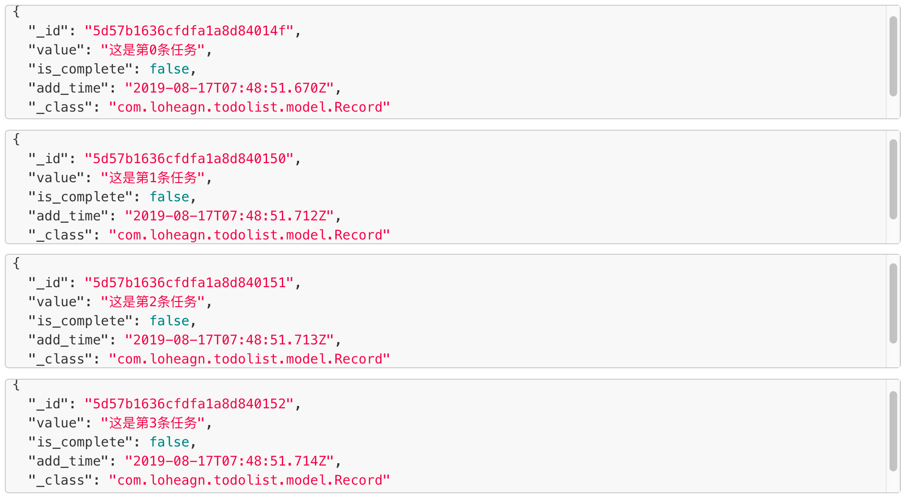

# SpringBoot中使用MongoDB

## 创建SpringBoot web项目

根据之前的介绍，使用spring initializer创建我们熟悉的一个最简单的springboot web项目。

## 添加依赖

在项目的根目录中的`pom.xml`中添加依赖：
```xml
<dependency>
    <groupId>org.springframework.boot</groupId>
    <artifactId>spring-boot-starter-data-mongodb</artifactId>
</dependency>
```

## 配置

在application.properties文件中添加MongoDB的uri，如果是默认的本地数据库的话，可以添加：`spring.data.mongodb.uri=mongodb://127.0.0.1/相应的数据库名`。

## 创建实体类

假定我们的业务类需要使用一个实体类Record，很自然，我们会在数据库中创建一张表来记录所有的Record。我们希望spring自动将我们创建的这样一个Record实体类映射成MongoDB中的一个表结构（实际上是集合的数据结构）。用过Django的同学对这个应该很熟悉。

为了达到这样的目的，我们创建一个model包（遵从MVC架构），这里面新建一个Record类，这个类在创建的时候需要加一些注解，写起来就像是这样：

```java
@Document(collection = "record_info")
public class Record {
    @Id
    private String id;

    @Field("value")
    private  String value;

    @Field("is_complete")
    private boolean isComplete;

    @Field("add_time")
    private Date addTime;

    // 省略剩下的getter和setter和tostring方法
}
```

- 其中，`@Document(collection = "record_info")`表明，Record类的记录位于数据库的名为`record_info`的集合中。

- `@Field`表示Record类中的成员变量在数据库中存储时应该使用怎样的字段。

- 经过以上设置，在日后在数据库中存入相应的Record数据后，我们将会看到类似这样的记录：
  

## 数据库操作接口

现在我们把我们的实体类和数据库中具体的存储方式结合起来了。那么我们还需要有一堆对Record增删改查的方法。这些方法写在哪里呢？当然是写在model层的一个类中。

首先，我们可以再model层中新建一个接口，这个接口中描述了我们需要实现的各个数据库操作的方法。

```java
public interface RecordDao {

    void saveRecord(Record record);

    void saveRecords(List<Record> records);

    void removeRecordsById(String id);

    void removeAllRecords();

    List<Record> getAllRecords();

}
```

## 实现数据库操作接口

接着，在model层中新建一个类，这个类实现了我们在上一小节中定义的RecordDao接口。

```java
@Component
public class RecordDaoImpl implements RecordDao {

    @Resource
    private MongoTemplate mongoTemplate;

    @Override
    public List<Record> getAllRecords() {
        return mongoTemplate.findAll(Record.class);
    }

    @Override
    public void saveRecord(Record record) {
        mongoTemplate.save(record);
    }

    @Override
    public void saveRecords(List<Record> records) {
        mongoTemplate.save(records);
    }

    @Override
    public void removeAllRecords() {
        mongoTemplate.dropCollection(Record.class);
    }

    @Override
    public void removeRecordsById(String id) {
        mongoTemplate.remove(id);
    }
}
```

这里有两个陌生的注解，我们一起来看一下。

- `@Component`注解表示这个类RecordDaoImpl将会成为Spring IOC容器的一个组件，被spring统一管理。之后我们会看到它的作用。

- `@Resource`这个注解表示对成员变量`mongoTemplate`自动进行依赖注入。什么意思呢？我们看到，我们自始至终使用mongoTemplate的过程中并没有对mongoTemplate进行初始化，按理来说在使用它的时候它应该是null，运行期间应该会报错。但实际不是这样，为什么呢？因为`@Resource`告诉spring去IOC容器中按照类名MongoTemplate寻找匹配的bean来完成对成员变量mongoTemplate的初始化。而具体的mongoTemplate的配置信息我们之前已经说明过，所以具体过程不需要我们操心，spring都帮我们自动完成了。

- 这里使用了依赖注入的设计模式。知乎上这个回答介绍的很好：[如何用最简单的方式解释依赖注入？依赖注入是如何实现解耦的? - 胡小国的回答 - 知乎](
https://www.zhihu.com/question/32108444/answer/309208647)。

## 如何使用上述定义的方法？

我们设计两个涉及数据库操作的URL请求，一个请求数据库中所有的Record记录，一个申请新建一个Record并存入数据库中，写出相应的controller：

```java
@RestController
public class MainController {


    @Autowired
    private RecordDao recordDao;

    @GetMapping("/get_all_records")
    public List<Record> getAllRecords(){
        List<Record> records = recordDao.getAllRecords();
        records.forEach((System.out::println));
        return records;
    }

    /**
     * 新建一条任务记录
     * @param json
     * @return
     */
    @PostMapping("/add_record")
    public String addRecord(@RequestBody String json){
        JSONObject jsonObject = new JSONObject(json);
        Record record = new Record();
        record.setComplete(false);
        record.setAddTime(new Date());
        record.setValue(jsonObject.get("value").toString());
        recordDao.saveRecord(record);
        return "success";
    }
}
```

- 可以看到，我们在MainController类中定义了一个变量recordDao，这是一个接口，我们在后面的方法中都直接使用该接口中定义的类。

- 等等，我们直接定义了这个接口后什么都没做啊，谁完成了对它的初始化，又是用哪个具体的类这个接口初始化的？

- 答案的关键在于注解`@Autowired`，该注解和上面提到的`@Resource`很相似，都是自动扫描IOC容器中的匹配的bean，完成对所标注的成员变量的注入。

- 我们在变量recordDao上使用`@Autowired`的目的就是告诉spring，去容器中寻找实现了RecordDao这个类型的接口的类，用这个类对变量recordDao进行初始化。spring在容器中找到了唯一一个实现了该接口的RecordDaoImpl类，于是就用它完成变量的初始化了。

- 为什么我们自定义的类RecordDaoImpl会在spring的容器中呢？那是因为我们在定义这个类的时候加上了`@Component`注解！
