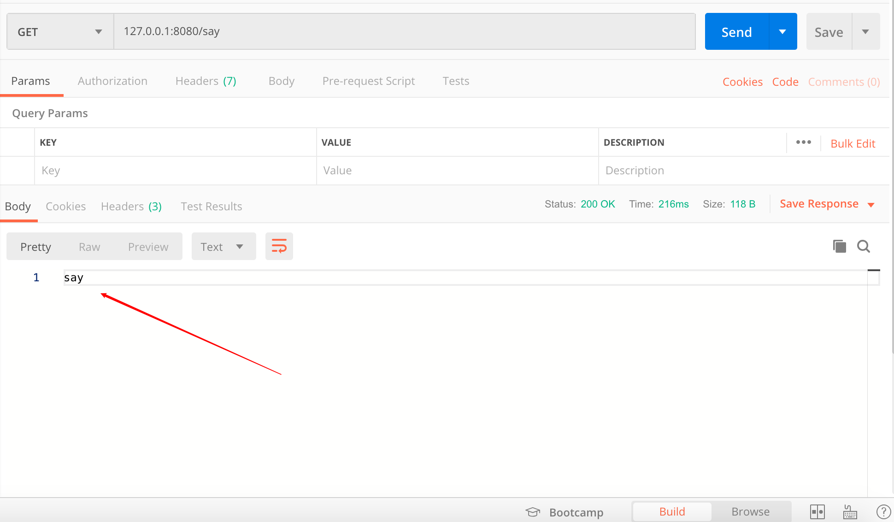
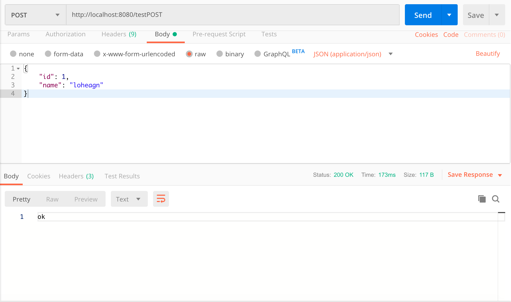

# SpringBoot处理GET和POST请求

## 几个相关的注解

### @Controller

该注解用在类上，表示该类是一个HTTP请求控制类。我们所编写的所有处理HTTP请求的方法都会放到这样的类里面。

### @Responsebody

- 该注解的作用将把我们编写的处理HTTP请求的方法的返回值转换为相应的格式，写入到HTTP请求的响应体中。在不使用视图处理器的情况下，不写该注解，访问该URL时，会产生500错误。

- 该注解可以写直接写在`@Controller`标记的类中，这样就相当于给该类里面的所有方法都加上了该注解；也可以在每个具体的方法上单独添加。

### @RestController

`@RestController`是`@Controller`和`@Responsebody`两个注解的合体。一般情况下，我们直接在控制类前面写上这个注解就完事了。

### @RequestMapping

该注解用于映射URL。

- 最简单的用法是在处理该URL的方法上这样写，`@RequestMapping(字符串)`，表示该方法处理的URL是`http://localhost:8080/字符串/`（假设我们的服务器部署在本地，端口是8080）。比如有下面的用法
    ```java
    @RestController
    public class TestController {

        @RequestMapping("/say")
        public String say() {
            return "say";
        }
    }
    ```
  那么，我们当访问`http://localhost:8080/say/`时，将返回字符串`say`：
  
  
- 当然，也可以在类上添加上述这样的`@RequestMapping(字符串)`注解，比如这样：
    ```java
    @RestController
    @RequestMapping("/say")
    public class TestController {

        @RequestMapping("/say")
        public String say() {
            return "say";
        }
    }
    ```
  这时，我们的`say()`方法处理的就将是URL为`http://localhost:8080/say/say/`的请求。

- 上述`@RequestMapping(字符串)`的用法实际上是`@RequestMapping(value=字符串, method=RequestMethod.GET)`的缩写。其中，method表示处理的HTTP请求的类型，可以是`GET, POST, HEAD, OPTIONS, PUT, PATCH, DELETE, TRACE`。

- `@RequestMapping`的更多用法请参考[官方文档](https://docs.spring.io/spring/docs/current/javadoc-api/org/springframework/web/bind/annotation/RequestMapping.html)。

### @GetMapping

该注解就是指定了`method=RequestMethod.GET`的`@RequestMapping`。

### @PostMapping

该注解就是指定了`method=RequestMethod.POST`的`@RequestMapping`。


## 获取GET请求中的参数

GET请求中的参数一般直接包含在URL中，一般就是这种类型：`http://127.0.0.1:8080/testGET?id=3&name=loheagn`。

#### 直接把URL中包含的参数名写在处理方法的形参中

比如，要处理我们前面提到的URL可以这样写：

```java
@GetMapping("/testGET")
public String testGET(int id, String name) {
    System.out.println("id is " + id);
    System.out.println("name is " + name);
    return "ok";
}
```

其中，参数的**名称**必须和URL中的参数保持严格一致，参数的个数和顺序没有严格限制。

#### 通过HttpServletRequest接收

```java
@GetMapping("/testGET")
public String testGET(HttpServletRequest request) {
    String id = request.getParameter("id");
    String name = request.getParameter("name");
    System.out.println("id is " + id);
    System.out.println("name is " + name);
    return "ok";
}
```

这也是我们的小Demo中用的方法。

#### 使用注解@RequestParam

```java
@GetMapping("/testGET")
public String testGET(@RequestParam("id") int id, @RequestParam("name") String name) {
    System.out.println("id is " + id);
    System.out.println("name is " + name);
    return "ok";
}
```

这里的要求是该方法中有的形参，URL中也一定要有，否则会报错。要想实现URL中不一定包含所有的形参，可以在`@RequestParam`中添加参数`required=false`，比如
```java
@GetMapping("/testGET")
public String testGET(@RequestParam("id") int id, @RequestParam(value = "name", required = false) String name) {
    System.out.println("id is " + id);
    System.out.println("name is " + name);
    return "ok";
}
```

## 获取POST请求体中的参数

这里讨论的POST中的参数不是包含在URL中的，而是包含在HTTP请求的body中的JSON对象。

前端可能这么写：
```js
var json_data={
    "id": 1,
    "name": "loheagn"
    };
$.ajax({
    url : 'http://127.0.0.1:8080/testPOST',
    type : 'post',
    data : JSON.stringify(json_data),
    contentType : 'application/json;charset=utf-8'
    });
```

相应地，后端这样来处理：
```java
@PostMapping("/testPOST")
public String testPOST(@RequestBody String json) {
    JSONObject jsonObject = new JSONObject(json);
    String id = jsonObject.get("id").toString();
    String name = jsonObject.get("name").toString();
    System.out.println("id is " + id);
    System.out.println("name is " + name);
    return "ok";
}
```

这里实现的基本思路就是，先在形参中使用`@RequestBody`注解获取HTTP请求体中的json字符串，然后用随便一个第三方的json工具包解析该字符串，提取相应信息即可。



## 返回response

@Responsebody注解可以很方便地自动将返回类型转换为text格式（对应返回值为普通字符串的情况）或者json格式（返回值为数组或对象）。