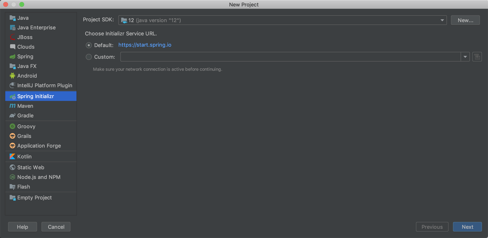
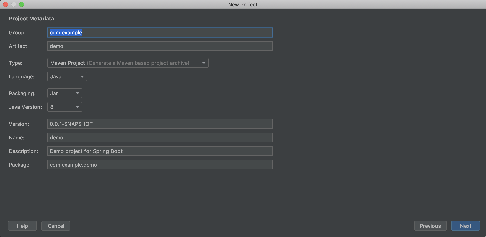
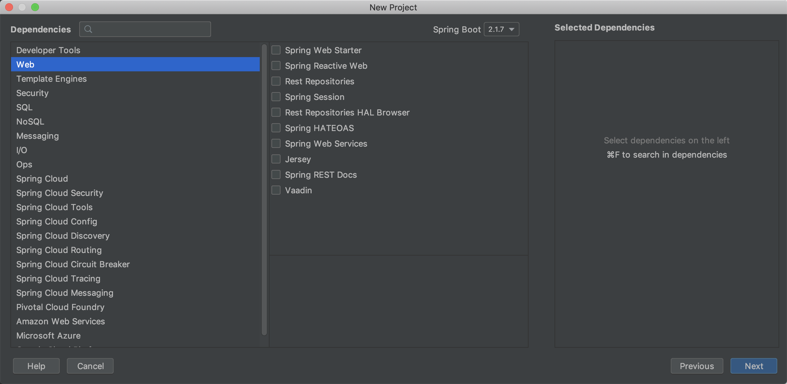
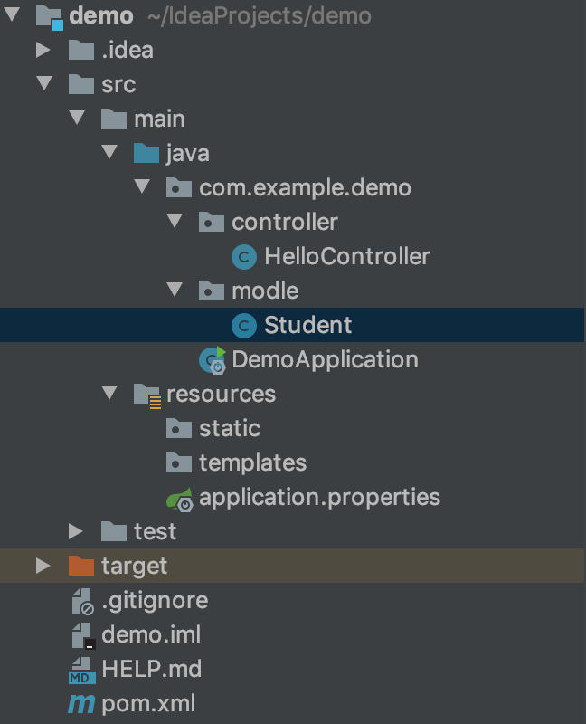
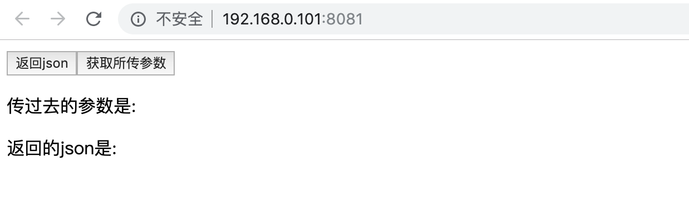
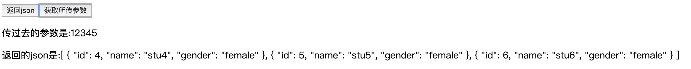

# 如何用SpringBoot写接口并处理Http请求

在上次我发的vue的文档中最后写了如何发送`ajax`请求，我们可以用`SpringBoot`处理`ajax`请求并返回一个json数据

首先新建一个`SpringBoot`项目



这里不用管，点击`next`



这里可以设置包名等，点击`next`



在这里添加依赖，我们需要添加这个`Spring Web Starter`，之后要使用`MongoDB`的话在`NoSQL`中添加相应依赖就行



项目结构如图，(一些无用文件我删掉了，不动它也行)，按上图所示新建一个`controller`和`model`，`model`是要返回数据的模型，比如我要返回一个学生

```java
package com.example.demo.model;

public class Student {
    private int id;
    private String name;
    private String gender;

    public Student(int id, String name, String gender) {
        this.id = id;
        this.name = name;
        this.gender = gender;
    }

    public int getId() {
        return id;
    }

    public void setId(int id) {
        this.id = id;
    }

    public String getName() {
        return name;
    }

    public void setName(String name) {
        this.name = name;
    }

    public String getGender() {
        return gender;
    }

    public void setGender(String gender) {
        this.gender = gender;
    }
}

```

`student`类如上，然后在`controller`新建一个`HelloController`

```java
package com.example.demo.controller;

import com.example.demo.model.Student;
import org.springframework.web.bind.annotation.GetMapping;
import org.springframework.web.bind.annotation.RequestMapping;
import org.springframework.web.bind.annotation.RestController;
import org.springframework.web.context.request.RequestContextHolder;
import org.springframework.web.context.request.ServletRequestAttributes;

import javax.servlet.http.HttpServletRequest;
import javax.servlet.http.HttpSession;
import java.util.ArrayList;
import java.util.List;

@RestController
@RequestMapping(value = "api")

public class HelloController {
   @GetMapping(value = "studentMan")
    public String getStudentManList(){
       HttpServletRequest request = ((ServletRequestAttributes) RequestContextHolder.getRequestAttributes()).getRequest();
       HttpSession session = request.getSession();
       String id = request.getParameter("id");
       return id;
   }
   @GetMapping(value = "studentWoman")
    public List<Student> getStudentWomanList(){
       Student stu4 = new Student(4,"stu4","female");
       Student stu5 = new Student(5,"stu5","female");
       Student stu6 = new Student(6,"stu6","female");
       List<Student> list2 = new ArrayList<>();
       list2.add(stu4);
       list2.add(stu5);
       list2.add(stu6);
       return list2;
   }

}

```

这段代码分两个场景

1. 第一个场景`studentMan`用来测试从vue中传来的参数这里能不能接收，并且把这个参数传回去
2. 第二个场景是在后端生成一些`json`对象，并返回给前台

看看我们前端代码是怎么写的

```vue
<template>
    <div id="home">
        <button v-on:click="getmsg">返回json</button>
        <button v-on:click="getpara">获取所传参数</button>
        <p>传过去的参数是:{{userpara}}</p>
        <p>返回的json是:{{userdata}}</p>
    </div>
</template>

<script>
    export default {
        name: "home",
        data: function () {
            return {
                userdata: null,
                userpara: null
            }
        },
        methods: {
            getpara: function () {
                this.$http.get('/api/studentMan?id=12345').then((res) => {
                    this.userpara = res.data;
                }).catch((error) => {
                    console.warn(error)
                })
            },
            getmsg:function () {
                this.$http.get('/api/studentWoman').then((res) => {
                    this.userdata = res.data;
                }).catch((error) => {
                    console.warn(error)
                })
            }
        }
    }
</script>

<style scoped>

</style>
```

关于跨域的配置上个文档里面已经写了，这里不再赘述



上面代码中我们可以看到我们传递的参数是`id`值为`12345`，点击获取所传参数就会将其显示出来，然后从后端能获取我们预先写好的几个学生的信息，点击返回json就可以获取



可以看到，和我们预想的结果一致