# 小学期准备之Vue.js

推荐大家看https://cn.vuejs.org/v2/guide/，也就是vue官网的教程

我使用的开发工具为webstorm，里面有vue现成的开发模板，使用vscode也可以

在学习之前最好了解一下html，css，js的基本语法

## Vue-cli

开发的时候我们一般不用官网在前半部分的在每个页面实例化Vue的方法，一般我们会直接使用Vue-cli这样一个标准工具，其安装步骤如下

在已经装好node.js环境的前提下

```js
npm install -g @vue/cli
```

或者直接使用webstorm新建一个Vue项目

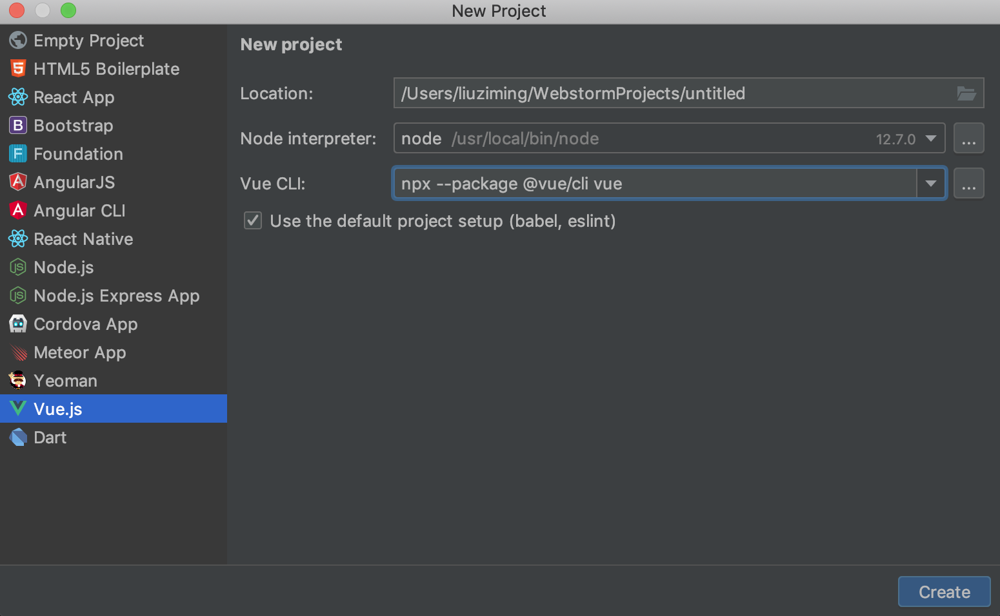

建好项目之后项目的结构如下所示

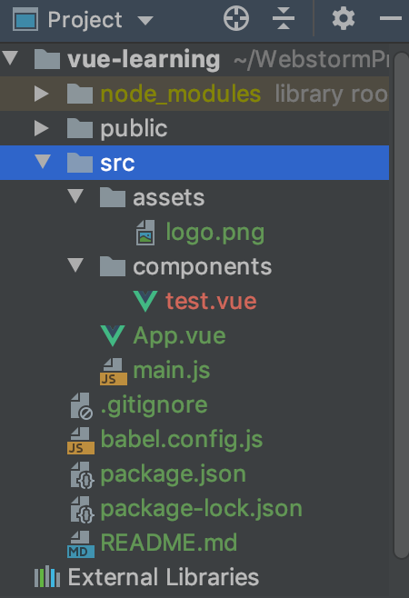

现在我们来看一下里面各个文件以及目录的大概作用

- src目录存放了本项目的核心文件，其中
  - asserts存放静态资源，比如css以及一些外部js文件
  - components是组件的存放目录
  - router(这上面暂时没有安装)是配置项目路由的目录
  - App.vue是项目的根组件
  - main.js是项目的入口文件,主要用来初始化Vue实例并使用需要的插件

所谓**组件**，其实就是可复用的vue实例，将一个个的组件拼起来就可以构成我们的前端页面。就比如说我们有一个导航栏，我们就可以把它写成一个组件，这样在每个页面都可以复用了。

在我下面的实例代码中，都采取了**单文件组件**的写法，在`components`文件夹下新建一个`.vue`文件，`webstorm`会自动帮你创建单文件组件的模板

## Vue生存周期


首先我们会实例一个Vue对象，在创建对象之前中，会执行`beforeCreate`，这个时候我们可以进行加载动作。之后组件已经创建好并且属性也已经被绑定了，但是我们的DOM并没有生成，此时执行的是`created`，这个时候我们通常请求相关网络接口，获得相关数据赋值给相关属性，并且可以把`beforeCreate`阶段执行的加载任务给结束。

`beforeMount`在有了`render function`的时候才会执行，当执行完`render function`之后，就会调用`mounted`这个钩子，在`mounted`挂载完毕之后，这个实例就算是走完流程了。

后续的钩子函数执行的过程都是需要外部的触发才会执行。比如说有数据的变化，会调用`beforeUpdate`，然后经过`Virtual DOM`，最后`updated`更新完毕。当组件被销毁的时候，它会调用`beforeDestory`，以及`destoryed`。

## Vue模板语法

关于上面所说的组件以及路由等部分我们先有个初步了解就可以，现在我们来看一下Vue的模板语法，Vue使用了基于HTML的模板语法，如果你使用过Django或者Flask这些框架的话很容易理解这个。请看下面这个例子：

```vue
<template>
    <div>
        {{ message }}
    </div>
</template>

<script>
    export default {
        name: "test",
        data:function () {
            return{
                message:'hello world'
            }
        }
    }
</script>

<style scoped>

</style>
```

在以上代码中，你可能会奇怪`{{ message }}`是个什么玩意，其实这就是所谓的模板语法的一种，它将DOM绑定到了底层Vue实例的数据，比如这个`{{ message }}`就绑定了底下的`message`，并且在应用状态改变的时候，Vue可以智能地计算出重新渲染组件的最小代价并应用到DOM上

### 输出HTML代码

在上面我们展示了绑定普通文本，那么如果想输出HTML怎么办呢？

```vue
<template>
    <div v-html="message"></div>
</template>

<script>
    export default {
        name: "test",
        data:function () {
            return{
                message:'<h1>It is message</h1>'
            }
        }
    }
</script>

<style scoped>

</style>
```

效果如下所示

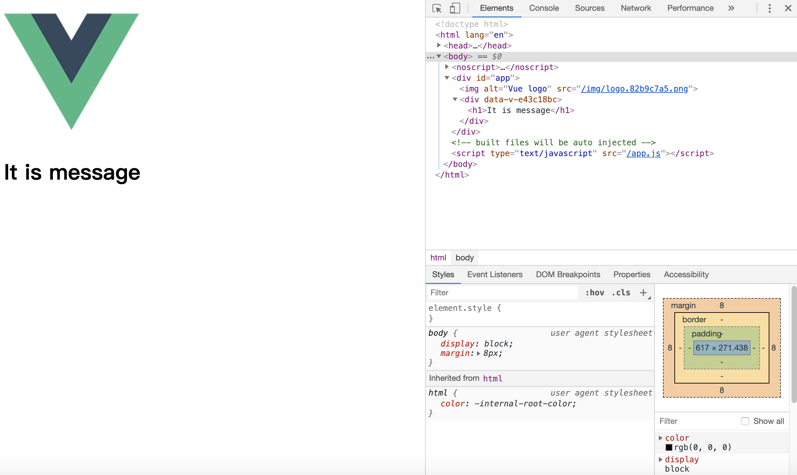

可以看到，页面已经被渲染为`<h1>It is message</h1>`，也就是说HTML代码已经被渲染进去了。这里我们使用了`v-html`这个指令，可以将绑定的变量解析为HTML输出。

除此之外，还可以直接绑定一个js表达式，比如

```vue
{{ number + 1 }}
```

但是我不推荐使用这种，在后面我们会学一个叫计算属性的东西，笔者认为那个更好用一点

## 计算属性和侦听器

### 计算属性

我们先来看一个反转字符串的例子

```vue
<div id="app">
  {{ message.split('').reverse().join('') }}
</div>
```

按我们之前的说法，我们会采用如上这种写法，使用了一个js表达式，但是我们仔细想一想这样写是有问题的，因为每次即使我们的message没有改变，系统还是会重新加载一次，显然这造成了不必要的浪费，计算属性就是为了解决这个问题

```vue
<template>
    <div id="computed">
        <p>Original message:{{ message }}</p>
        <p>Computed reversed message:{{ reversedMessage}}</p>
    </div>
</template>

<script>
    export default {
        name: "test",
        data:function () {
            return{
                message:'Hello World'
            }
        },
        computed:{
            reversedMessage:function () {
                return this.message.split('').reverse().join('');
            }
        }
    }
</script>

<style scoped>

</style>
```

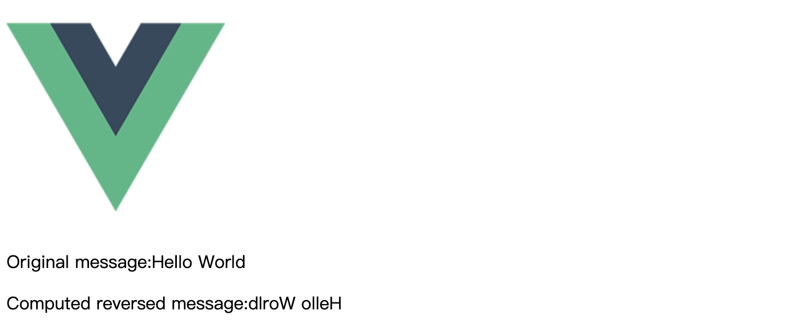

虽然说这两种写法达到的效果是完全一样的，但是**计算属性是基于它们的响应式依赖进行缓存的**，也就是说只有它依赖的属性，比如上面的`message`发生改变时，它才会再次执行函数，否则直接会返回之前的`message`，相比之下，每当触发重新渲染时，调用方法将总会再次执行函数。

所以我推荐：**对于任何的复杂逻辑，你都应该使用计算属性**，比如搜索等操作。

### 侦听器

相比来说

- `watch`用来处理一个数据影响多个数据的情形
- `computed`用来处理一个数据受多个数据影响的情形

当需要在数据变化时执行异步或开销较大的操作时，侦听属性是有用的

```vue
<div id="watch-example">
  <p>
    Ask a yes/no question:
    <input v-model="question">
  </p>
  <p>{{ answer }}</p>
</div>
```

```vue
var watchExampleVM = new Vue({
  el: '#watch-example',
  data: {
    question: '',
    answer: 'I cannot give you an answer until you ask a question!'
  },
  watch: {
    // 如果 `question` 发生改变，这个函数就会运行
    question: function (newQuestion, oldQuestion) {
      this.answer = 'Waiting for you to stop typing...'
      this.debouncedGetAnswer()
    }
  },
  created: function () {
    // `_.debounce` 是一个通过 Lodash 限制操作频率的函数。
    // 在这个例子中，我们希望限制访问 yesno.wtf/api 的频率
    // AJAX 请求直到用户输入完毕才会发出。想要了解更多关于
    // `_.debounce` 函数 (及其近亲 `_.throttle`) 的知识，
    // 请参考：https://lodash.com/docs#debounce
    this.debouncedGetAnswer = _.debounce(this.getAnswer, 500)
  },
  methods: {
    getAnswer: function () {
      if (this.question.indexOf('?') === -1) {
        this.answer = 'Questions usually contain a question mark. ;-)'
        return
      }
      this.answer = 'Thinking...'
      var vm = this
      axios.get('https://yesno.wtf/api')
        .then(function (response) {
          vm.answer = _.capitalize(response.data.answer)
        })
        .catch(function (error) {
          vm.answer = 'Error! Could not reach the API. ' + error
        })
    }
  }
})
</script>
```

例子取了官网的例子，可以看到，侦听器就是用来检测某个变量有没有发生变量，如果发生了，就执行相应方法

## 动态绑定样式

我们使用`v-bind:class`来进行样式的动态绑定，如果这个对象的值是`true`就会显示相应样式，否则不会显示，代码如下所示

```vue
<template>
    <div id="computed">
        <p v-bind:class="{red:isRed}">I am red one</p>
        <p v-bind:class="{green:isGreen}">I am green one</p>
    </div>
</template>

<script>
    export default {
        name: "test",
        data: function () {
            return {
                isRed: true,
                isGreen: true
            }
        },
    }
</script>

<style scoped>
    .red {
        background-color: red;
    }

    .green {
        background-color: green;
    }
</style>
```

效果如下

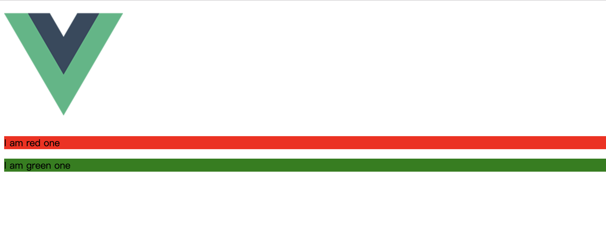

除了内联定义在模板里，也可以放在data中，甚至可以绑定一个返回对象的计算属性

## 条件渲染

```vue
<template>
    <div id="computed">
        <p v-if="isRed">red is showed</p>
        <p v-if="isGreen">green is showed</p>
        <p v-else>green is not showed</p>
    </div>
</template>

<script>
    export default {
        name: "test",
        data: function () {
            return {
                isRed: true,
                isGreen: false
            }
        },
    }
</script>

<style scoped>
</style>
```

效果如下

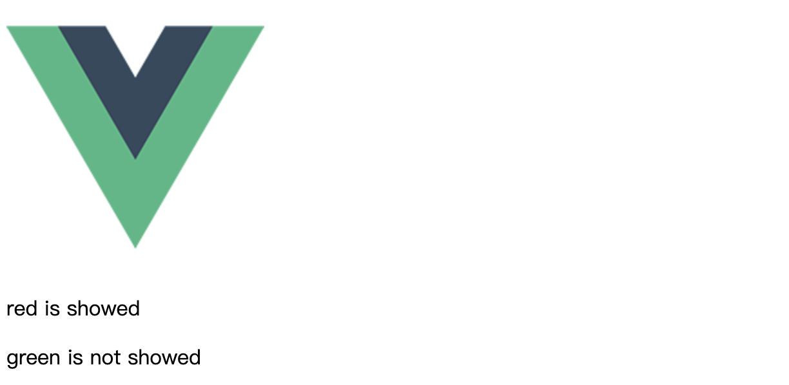

可以看到也是相关对象值为真的才会显示，否则被隐藏

可以看到，这样只能切换一个元素，那么如果我想同时切换多个元素呢？

```vue
<template v-if="ok">
  <h1>Title</h1>
  <p>Paragraph 1</p>
  <p>Paragraph 2</p>
</template>
```

此时我们可以把一个`<template>`元素当做不可见的包裹元素，并在上面使用`v-if`

### 使用`key`管理可复用的元素

此内容官网已经将的十分清楚了，https://cn.vuejs.org/v2/guide/conditional.html，key可以决定是否复用已有元素而不从头开始渲染

## 列表渲染

我们在实际写web应用的时候肯定遇到过这种情况，比如我们要显示文章列表，这个时候后端返给我们一个含有所有文章标题的数组，我们要做的就是要把这个数组显示出来

Vue给我们提供了`v-for`指令

```vue
<template>
    <div>
    <template v-for="article in bigger3">
        <p>article id:{{article.id}}</p>
        <p>article name:{{article.name}}</p>
    </template>
    </div>
</template>

<script>
    export default {
        name: "test",
        data: function () {
            return {
                articles: [{id: 1, name: 'book1'}, {id: 2, name: 'book2'}, {id: 3, name: 'book3'}],
            }
        },
        computed:{
            bigger3:function () {
                return this.articles.filter(function (article) {
                    return article.id > 2;
                })
            }
        }
    }
</script>

<style scoped>
</style>
```

上面是我写的demo，要注意template是不能加key属性的，而在使用属性的`v-for`时，key属性则是必须的。此外，`v-for`推荐 使用计算属性进行过滤而不是`v-for`和`v-if`一起使用，其它的一些细节参照https://cn.vuejs.org/v2/guide/list.html即可

## 事件处理

事件处理常用的无非是单击，双击，聚焦，失焦等，这些在原生js中一般是通过获取dom元素后给元素添加一个监听器来实现的，Vue使用`v-on`指令来监听dom，并在触发时执行一些js代码

```vue
<template>
    <div id="test">
        <button v-on:click="addone">+1</button>
        <p>{{ number }}</p>
    </div>
</template>

<script>
    export default {
        name: "test",
        data: function () {
            return {
                number: 0
            }
        },
        methods: {
            addone: function () {
                this.number += 1;
            }
        }
    }
</script>

<style scoped>
</style>
```

如上代码实现了点击按钮将底下数字加一的功能，这就是典型的对一个单击事件的处理

## 表单输入绑定

在前面我们进行的所有操作都是单向绑定的，只是把我们在vue实例中的数据绑定到某个dom上。但是表单是一类特殊的dom，它可以进行输入，因此我们就可以将表单和数据进行双向绑定

```vue
<template>
    <div id="test">
        <input v-model="message" v-bind="message">
        <p>{{ message }}</p>
    </div>
</template>

<script>
    export default {
        name: "test",
        data: function () {
            return {
                message: 'hello'
            }
        },
    }
</script>

<style scoped>
</style>
```

实现的效果如下;

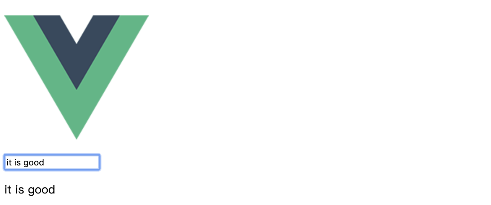

由于已经双向绑定了，所以你在输入框里输入什么，底下的`{{message}}`就会显示什么

对于其它类型的表单，操作方法是一样的，可参照https://cn.vuejs.org/v2/guide/forms.html

# Vue组件

之前提过一下Vue-cli，我们写的每个demo其实都是一个组件，下面我们来详细讲一下组件如何使用

## 组件注册

注册分为

1. 局部注册
2. 全局注册

首先来看看局部注册的使用方法

```vue
<template>
    <div id="test">
        <input type="checkbox" id="checkbox1" v-model="checked">
        <label for="checkbox1">{{checked}}</label>
    </div>
</template>

<script>
    export default {
        name: "test",
        data: function () {
            return {
                checked:false
            }
        },
    }
</script>

<style scoped>
</style>
```

```vue
<template>
    <div id="app">
        
        <test></test>
    </div>
</template>

<script>
    import test from './components/test'

    export default {
        name: 'app',
        components: {
            test
        }
    }
</script>

<style scoped>

</style>

```

上面是我们编写的一个`test`组件，下面是我们的根组件，我们在根组件中首先import我们的`test`组件，之后在我们的`export default`中注册这个组件

有的时候我们要经常性的复用某个组件，这个时候把这个组件设置成全局组件效果可能会更好

```vue
import Vue from 'vue'
import App from './App.vue'
import test from './components/test'
Vue.component('test', test);
Vue.config.productionTip = false

new Vue({
  render: h => h(App),
}).$mount('#app')

```

这个时候在`main.js`中import并注册就可以了

## Prop

Prop用来进行父组件和子组件的通信

```vue
<template>
    <div id="app">
        
        <test message="Hello everyone"></test>
        <test message="My name is LiNan"></test>
    </div>
</template>

<script>
    import test from './components/test'

    export default {
        name: 'app',
        components: {
            test
        }
    }
</script>

<style scoped>

</style>

```

```vue
<template>
    <div id="test">
        <p>{{message}}</p>
    </div>
</template>

<script>
    export default {
        name: "test",
        props: ['message'],
        data: function () {
            return {}
        },
    }
</script>

<style scoped>
</style>
```

可以看到，当一个值传递给prop时，它就变成了那个组件实例的一个属性,通常我们可以使用前面所提到的`v-bind`来动态传递`prop`，比如官网里那个显示博文列表的demo

```vue
<blog-post
  v-for="post in posts"
  v-bind:key="post.id"
  v-bind:title="post.title"
></blog-post>
```

这样先将属性绑定到从某个api获得的变量，然后将这些属性在子组件中设置成prop，之后在父组件中指定值

如果传递的属性太多，可以试着直接传递一个对象，比如

```vue
<blog-post
  v-for="post in posts"
  v-bind:key="post.id"
  v-bind:post="post"
></blog-post>
```

prop还具有验证类型的功能，比如官网的这个例子

```vue
Vue.component('my-component', {
  props: {
    // 基础的类型检查 (`null` 和 `undefined` 会通过任何类型验证)
    propA: Number,
    // 多个可能的类型
    propB: [String, Number],
    // 必填的字符串
    propC: {
      type: String,
      required: true
    },
    // 带有默认值的数字
    propD: {
      type: Number,
      default: 100
    },
    // 带有默认值的对象
    propE: {
      type: Object,
      // 对象或数组默认值必须从一个工厂函数获取
      default: function () {
        return { message: 'hello' }
      }
    },
    // 自定义验证函数
    propF: {
      validator: function (value) {
        // 这个值必须匹配下列字符串中的一个
        return ['success', 'warning', 'danger'].indexOf(value) !== -1
      }
    }
  }
})
```

当 prop 验证失败的时候，(开发环境构建版本的) Vue 将会产生一个控制台的警告

### 引用第三方组件库

组件可以接受任意的特性，而这些特性会被添加到这个**组件的根元素**上。

例如，你通过一个 Bootstrap 插件使用了一个第三方的 `<bootstrap-date-input>` 组件，然后这个 `data-date-picker="activated"` 特性就会自动添加到 `<bootstrap-date-input>` 这个组件的根元素上：

```html
<bootstrap-date-input
  data-date-picker="activated"
  class="date-picker-theme-dark"
></bootstrap-date-input>
```

该组件根元素为：

```html
<input type="date" class="form-control">
```

对于绝大多数特性来说，从外部提供给组件的值会替换掉组件内部设置好的值。所以如果组件上有 `type="text"` ，input的 `type="date"` 就会被替换掉并被破坏！`class` 和 `style` 特性会把两边的值会被**合并起来，最终的值：form-control date-picker-theme-dark。**

最终，input为：

```vue
<input
  type="date"
  data-date-picker="activated"
  class="form-control date-picker-theme-dark">
```

如果你**不**希望组件的根元素继承特性，你可以在组件的选项中设置 `inheritAttrs: false`，该选项**不会**影响 `style` 和 `class` 的绑定。适合配合实例的 `$attrs` 属性使用。

### 子传父

上边我们实现了父组件向子组件传值，反向传递

我们使用`$on(eventName)`来监听事件，使用`$emit(eventName)`来触发事件，例子如下

```vue
<div id="app">
    <div id="counter-event-example">
      <p>{{ total }}</p>
      <button-counter v-on:increment="incrementTotal"></button-counter>
      <button-counter v-on:increment="incrementTotal"></button-counter>
    </div>
</div>
 
<script>
Vue.component('button-counter', {
  template: '<button v-on:click="incrementHandler">{{ counter }}</button>',
  data: function () {
    return {
      counter: 0
    }
  },
  methods: {
    incrementHandler: function () {
      this.counter += 1
      this.$emit('increment')
    }
  },
})
new Vue({
  el: '#counter-event-example',
  data: {
    total: 0
  },
  methods: {
    incrementTotal: function () {
      this.total += 1
    }
  }
})
</script>
```

`$emit()`可以附带参数，附加参数都回传给监听器回调

### 插槽

和 HTML 元素一样，我们经常需要向一个组件传递内容，像这样：

```vue
<alert-box>
  Something bad happened.
</alert-box>
```

可能会渲染出这样的东西：

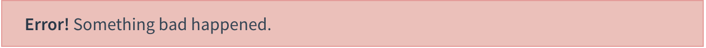

幸好，Vue 自定义的 `<slot>` 元素让这变得非常简单：

```vue
Vue.component('alert-box', {
  template: `
    <div class="demo-alert-box">
      <strong>Error!</strong>
      <slot></slot>
    </div>
  `
})
```

如你所见，我们只要在需要的地方加入插槽就行了

### 动态组件

动态组件就是几个组件放在一个挂载点下，然后根据父组件的某个变量来决定显示哪个，在挂载点使用`component`标签，然后使用`is=组件名`它会自动去找匹配的组件名

```vue
<template>
    <div id="test">
        <button v-on:click="change(0)">页面1</button>
        <button v-on:click="change(1)">页面2</button>
        <button v-on:click="change(2)">页面3</button>
        <component v-bind:is="selected"></component>
    </div>
</template>

<script>
    import comp1 from './comp1'
    import comp2 from "./comp2";
    import comp3 from "./comp3";
    export default {
        name: "test",
        data: function () {
            return {
                index: 0,
                comp:['comp1', 'comp2', 'comp3']
            }
        },
        methods: {
            change: function (index) {
                this.index = index;
            }
        },

        computed: {
            selected: function () {
                return this.comp[this.index];
            }
        },
        components:{
            comp1,
            comp2,
            comp3
        }
    }
</script>

<style scoped>
</style>
```

效果如下

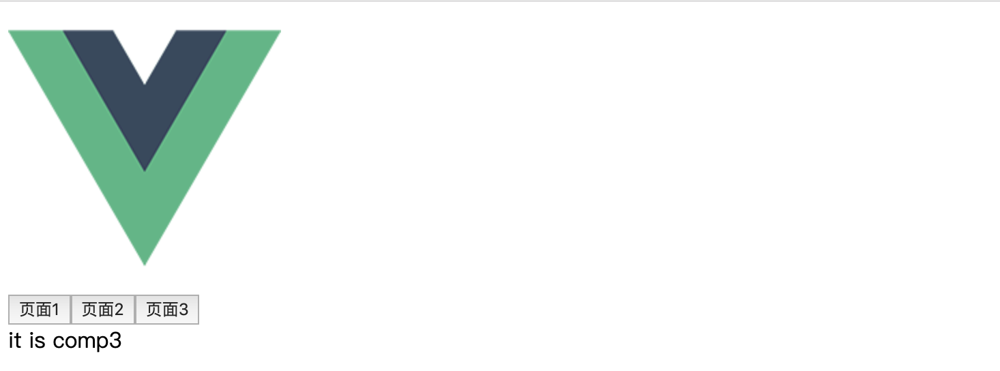

其中我写的`comp1`，`comp2`，`comp3`是三个组件，我们点击这三个页面按钮中的任何一个，底下的文字就会自动切换为相应组件中的文字

当在这些组件之间切换的时候，你有时会想保持这些组件的状态，以避免反复重渲染导致的性能问题，这个时候我们可以在组件上使用`keep-alive`标签

```vue
<keep-alive>
  <component v-bind:is="currentTabComponent"></component>
</keep-alive>
```

这样失活的组件将会被缓存，具体效果可以参照https://cn.vuejs.org/v2/guide/components-dynamic-async.html

### 异步组件

异步组件就是你有需要才向服务器请求加载的组件

```vue
<template>
  <div id="Menu">
    <component :is="currentLink"></component>
  </div>
</template>

<script>
export default {
  name: 'Menu',
  components: {
    Link1: () => import(`../plugs/Link1`),
    Link2: () => import(`../plugs/Link2`),
  },
  data () {
    return {
      plugs: [],
      currentLink: 'Link1'
    }
  },
}
</script>
```

如果想处理加载状态的话也可以用官网上的demo

```vue
const AsyncComponent = () => ({
  // 需要加载的组件 (应该是一个 `Promise` 对象)
  component: import('./MyComponent.vue'),
  // 异步组件加载时使用的组件
  loading: LoadingComponent,
  // 加载失败时使用的组件
  error: ErrorComponent,
  // 展示加载时组件的延时时间。默认值是 200 (毫秒)
  delay: 200,
  // 如果提供了超时时间且组件加载也超时了，
  // 则使用加载失败时使用的组件。默认值是：`Infinity`
  timeout: 3000
})
```

## Vue过渡和动画

这个我准备使用`element-ui`，里面有很多内置过渡和动画

## Vue路由

`vue-router`库允许我们通过不同的URL访问不同的内容

首先安装

`npm install vue-router`

之后在我们的`main.js`中配置相应路由

```vue
import Vue from 'vue'
import App from './App.vue'
import VueRouter from 'vue-router'
import hello from './components/hello'
import home from './components/home'

Vue.config.productionTip = false
Vue.use(VueRouter)

const router = new VueRouter({
    routes: [
        {path: "/", component: home},
        {path: "/hello", component: hello}
    ],
    mode: "history"
})

new Vue({
    router,
    render: h => h(App),
}).$mount('#app')

```

我在这里设置了两个路由，一个是`/`一个是`hello`，后面的这个`mode:history`是消除URL中的`#`，之后在根组件中设置

```vue
<template>
    <div id="app">
        <router-view></router-view>
    </div>
</template>

<script>
    export default {
        name: 'app',
    }
</script>

<style scoped>

</style>

```

之后在浏览器中输入相应路径就可以查看相应页面了

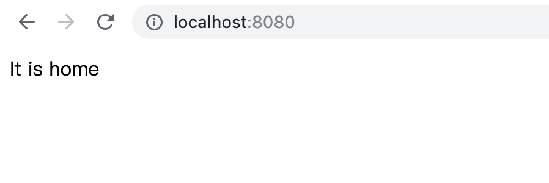

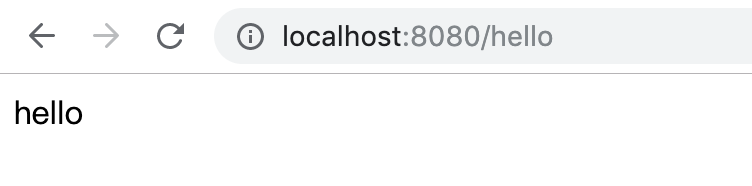


除此之外，我们可以用`<router-link>`来实现不重新加载的跳转，相比`<a>`标签利用资源的效率更高

除了这些基本的用法，还有子路由，路由传参，重定向等功能，推荐博客https://segmentfault.com/a/1190000014441507，里面讲的非常清楚

## Vue-ajax

我们使用`axios`来完成ajax请求，首先安装

`npm install axios`

之后在`main.js`中配置

```vue
import axios from 'axios'
Vue.prototype.$http = axios
```

```vue
<template>
    <div id="home">
        <button v-on:click="getmessage">请求数据</button>
        {{message}}
    </div>
</template>

<script>
    export default {
        name: "home",
        data:function () {
            return {
                message:null,
            }
        },
        methods:{
            getmessage:function () {
                this.$http.get('https://www.runoob.com/try/ajax/json_demo.json')
                    .then(response => (this.message = response))
                    .catch(function (err) {
                        console.log(err);
                    });
            }
        }
    }
</script>

<style scoped>

</style>
```

之后发出`get`请求企图获取数据

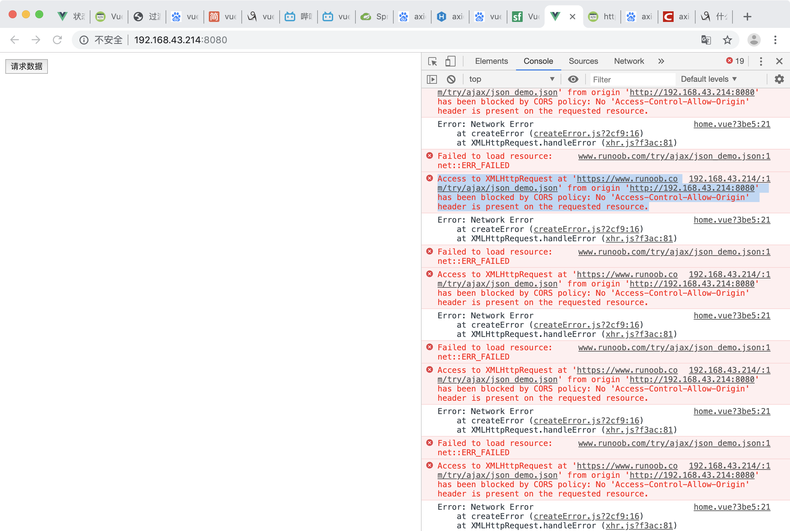

发现无法获取数据，这是为什么呢？因为我们这个请求是一个跨域请求

解决方法如下：

加入我们要请求如下所示的数据

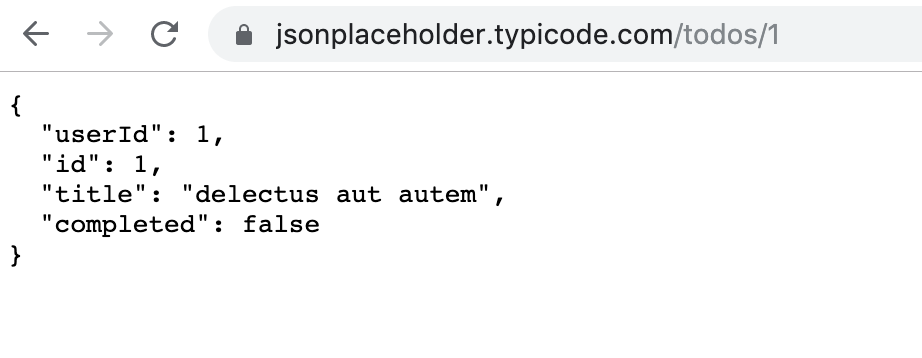

```vue
module.exports = {
    devServer: {
        proxy: {
            '/todos': {
                target:'http://jsonplaceholder.typicode.com', // 你请求的第三方接口
                changeOrigin:true, 
                pathRewrite:{  
                    '^/todos': '/todos'  
                }
            }
        } // string | Object
        // before: app => {}
    }, // 第三方插件配置
};
```

首先在根目录下创建一个`vue.config.js`,配置信息如上`'^/todos': '/todos'`的意思是，接口只要是`/todos`开头的才用代理

```vue
<template>
    <div id="home">
        <button v-on:click="getmessage">请求数据</button>
        <p>{{userdata}}</p>
    </div>
</template>

<script>
    export default {
        name: "home",
        data:function () {
            return {
                userdata:null,
            }
        },
        methods:{
            getmessage:function () {
                this.$http.get('/todos/1').then((res) => {
                   this.userdata = res.data;
                }).catch((error) => {
                    console.warn(error)
                })
            }
        }
    }
</script>

<style scoped>

</style>
```

这样我们点击请求数据，就会在下面加载出之前我们提到的数据了

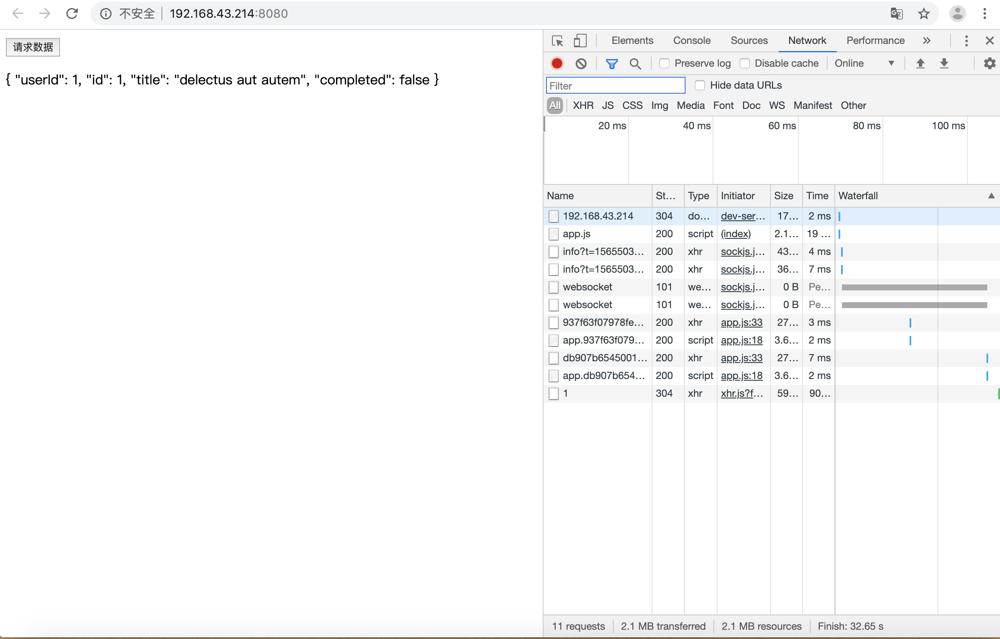

其余的请求方式参照https://www.runoob.com/vue2/vuejs-ajax-axios.html